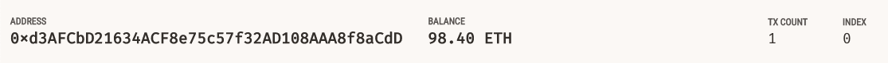
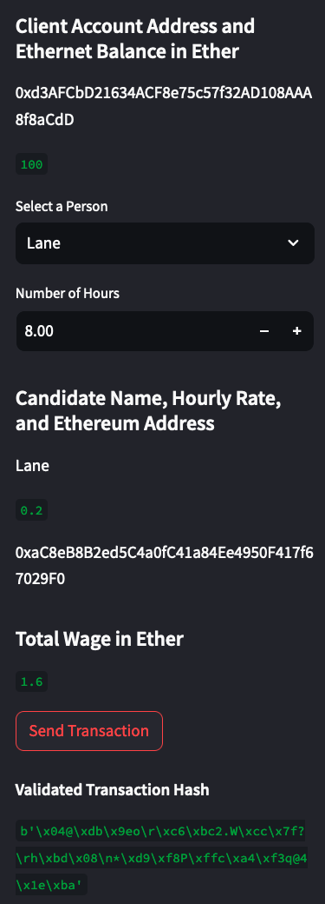
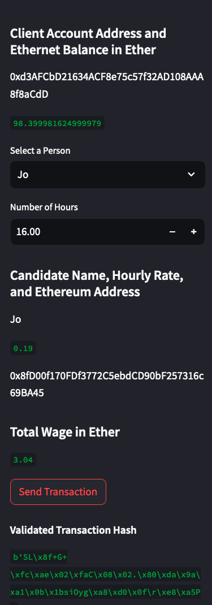
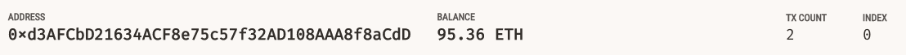
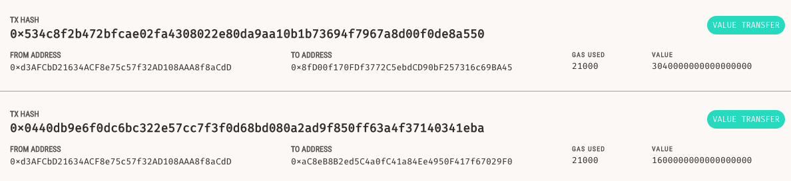

## Unit 19 Homework: Cryptocurrency Wallet

### Background

You work at a startup that is building a new and disruptive platform called KryptoJobs2Go. KryptoJobs2Go is an application that its customers can use to find fintech professionals from among a list of candidates, hire them, and pay them. As KryptoJobs2Go’s lead developer, you have been tasked with integrating the Ethereum blockchain network into the application in order to enable your customers to instantly pay the fintech professionals whom they hire with cryptocurrency.

In this Challenge, you will complete the code that enables your customers to send cryptocurrency payments to fintech professionals. To develop the code and test it out, you will assume the perspective of a KryptoJobs2Go customer who is using the application to find a fintech professional and pay them for their work.

### Transaction Inspection with Associated Screen Captures
The below identifies the account balance after 1 account transfer. The account transfer.

The associated transaction details are as follows.

A secondary transaction was completed for confirmation, below are the details.

Final information concerning the transaction history can be seen in the screen shot below. This includes both test transactions.

